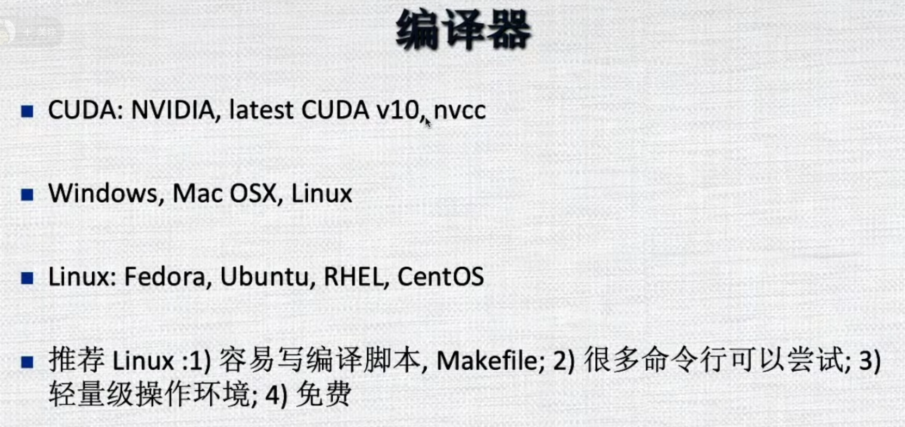
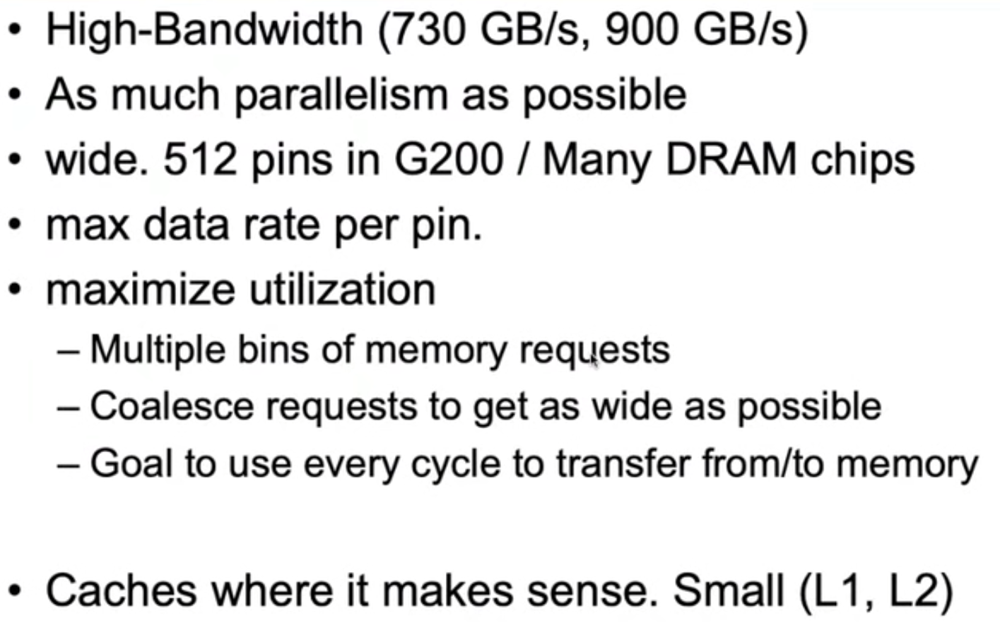
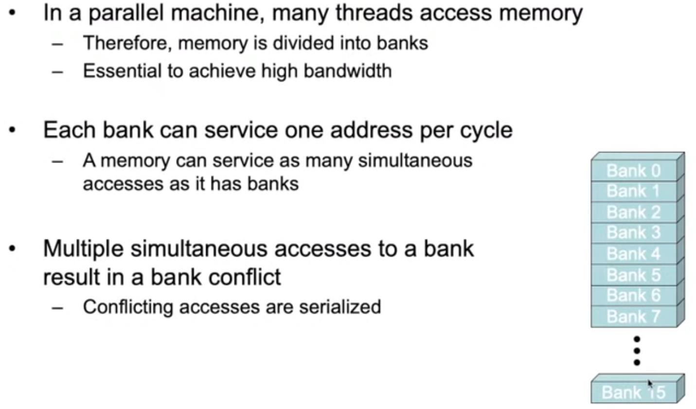
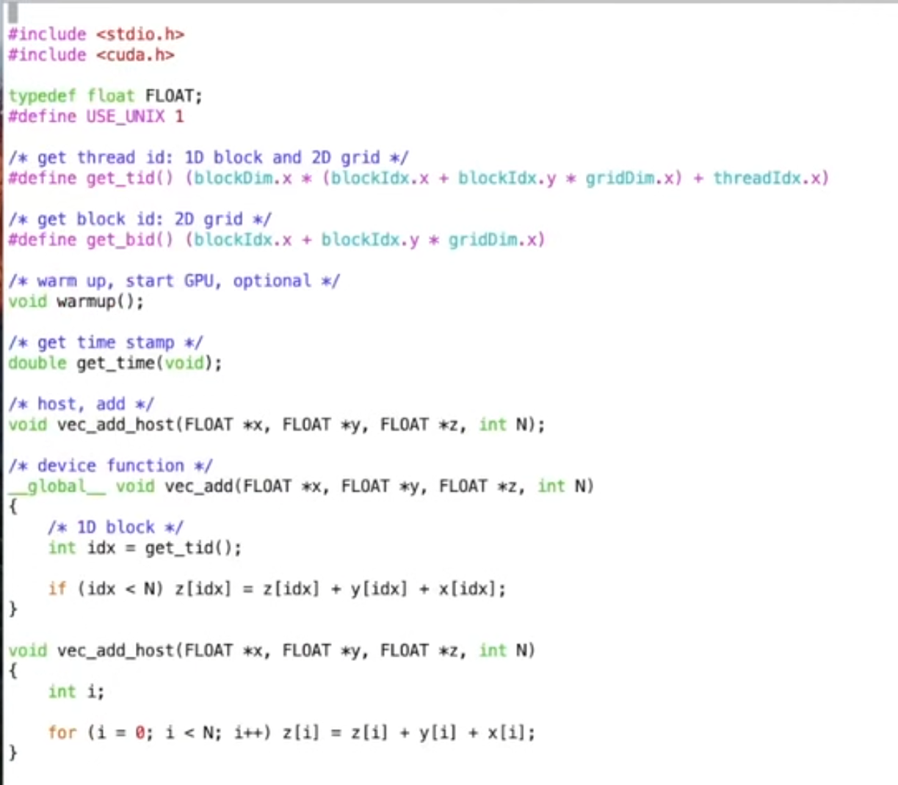
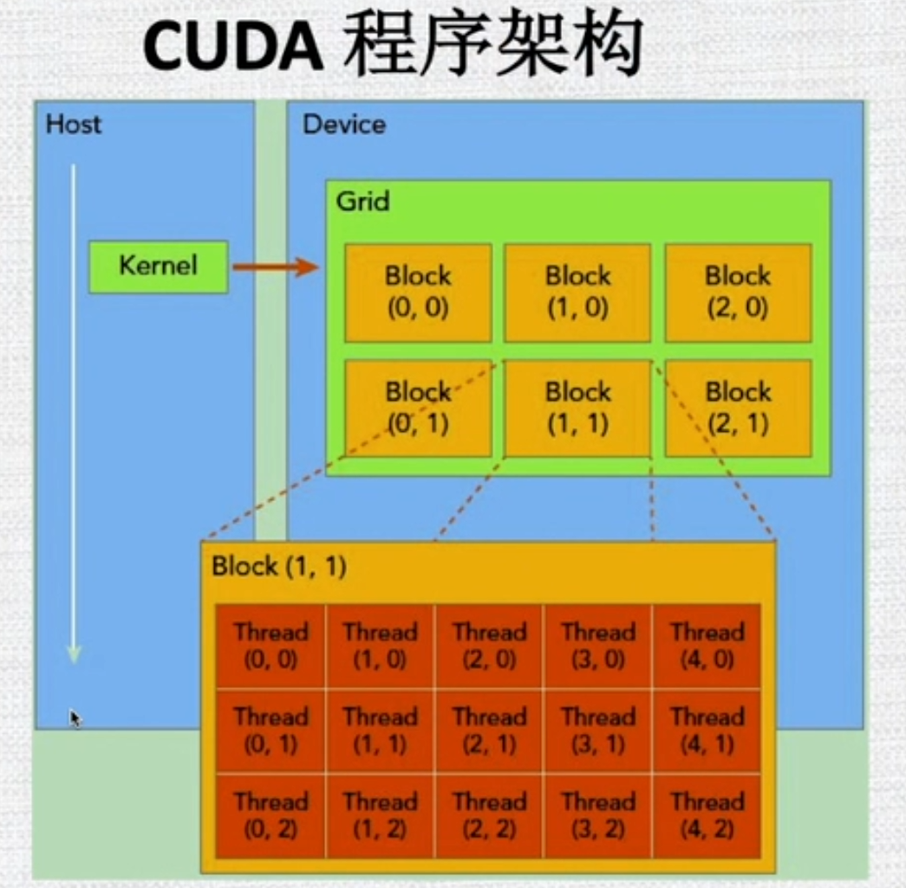

# 视频

【CUDA 编程入门】 https://www.bilibili.com/video/BV1vJ411D73S/?share_source=copy_web&vd_source=0c5cbba73f9b2526d3f3754c8f43abd7

# 1 什么是GPU运算

<font color="#dd0000">test</font>

<table><tr><td bgcolor="DarkSeaGreen"><font color="#dd0000">test</font></td></tr></table>

<table><tr><td bgcolor="Beige"><font color="#dd0000">test</font></td></tr></table>


通过L1内存和L2内存和它的显存想连接。WarpScheduler对每个线程和程序块如何执行，是对其排序的。GPU的L1比较小的，L1和共享内存加起来一共有64KB,不同的GPU不同。用户可以自行分配共享内存和L1高速内存的大小。


这是另外一个GPU，和刚才有一点不一样的是它是三级结构，它有GPC，它把四个SM放到一块叫做GPC,每个GPC中有四个SM，每个SM中有n个SP。目前最新的GPU可能含有5000多个计算核心，CPU才几十个。Intel最新的GPU还没发布，它将来要发布12000多个核心。你可想象核心的计算能力非常强大，利用好的话可以为很多计算密集型程序带来很大的性能提升。但是GPU计算由于硬件设计的因素它的编程和CPU编程不太一样，它需要专门的语言去处理GPU的运算。


- CUDA编程时NVIDIA在2000中期发布的，它是专门为NVIDIA的GPU做运算的。
- 它是和C和C++绑定的一套语言，但是python和Fortran也可以调用，程序的混编也是可以的。它定义了非常多的接口。
- GPU和cpu不太一样，它设计是用来做告诉运算的，我们一般把GPU当成运算平台，一般和CPU合作。
- 硬件上GPU直接插在主板上，装好GPU的驱动就可以了。
- GPU和CPU链接有很多的标准，一般是通过PCIE来进行链接的，它的速度可以达到16G/S或者32G/s。
- 当然也有其他的连接标准。GPU和CPU通过PCIE延迟要稍微高一些，如果通过最新的接口的话延迟可能会小一些。
- 我们有一个专门的术语，CPU称为主机端，GPU称为设备端。
- 最新的GPU有5000个计算核心，计算能力非常强大的。
- GPU比CPU快15倍左右。


- CPU有它自己的内存，就是我们平常说的内存
- GPU有它自己的内存，就是显存，或者全局内存。
- 关于内存分配这句话不完全对，早期的GPU的话是对的。最新的GPU可以申请一块公共的 区域然后CPU可以访问GPU也可以访问。
- 但是CUDA有它的接口需要特殊申请某一种类型的内存。
- 一般情况下CPU有自己的内存，GPU有自己的显存，如果有数据交换的话就通过数据拷贝就好了。
- 


- 我们一般CPU做些初始化逻辑控制等，如果有些程序需要并行处理等，比如计算量特别大的时候，就需要GPU。


- Fortan比较古老，性能挺好的，编译风格和程序结果和C/C++完全不一样。但是通过包一下的话也可以访问CUDA的函数的。
- python可以调用C/C++的，用函数名包装一下的话python也是可以调用CUDA编程的。
- 我们下面讲解基本上偏C/c++一块讲。



CUDA安装包中提供了一些工具


作为初学者建议直接试一下线程管理、块管理、网格管理这样理解更深厚一些。


关于内存管理、规约、向量的一些操作都在示例程序中有所展示。


# 2 GPU硬件架构综述


- feimi 的GPU有非常多的流多处理器，大概16个流多处理器，通过L2告诉缓存和全局内存相连。
- 每个流多处理器有32个核心，每个核心都是来计算的。通过互连网络，L1的缓存进行相连，但是它有内部的warp scheduler 一些特殊功能的单元，他们共享寄存器RegisterFile（32.768x32bit）。
- 每个流多处理器对GPU来说都有自己的资源，像这个流多处理器有32k的寄存器，64k的共享内存/L1高速缓存（他们共用64k）。通过程序可以设置共享内存和L1高速缓存的大小（64kB让他们俩分去）。


- GT200和feimi的GPU不太一样，它把每3个流多处理器分成一个TPC，每一个流多处理器有自己的计算核心。L1是24KB，它通过L2告诉缓存和显存进行链接。
- 这个GT200的GPU有10个TPC,所以它有30个流多处理器。


- 流多处理器含有32个或者16个流处理器，又称为SP，现在流行叫做CUDA Core。

- 因为GPU架构不太一样前期架构前期的可能流多处理器只有8个，16个SP，目前一般都是32个SP。


- 我们在设计程序的时候每个块可能含有128或者256个线程，他把每32个线程称为一个warp，它是一个虚拟的变形的结构。
- 我们后面在讲的时候warp都是并行的时候基本的运算单元，每个warp都是执行相同的命令往下走的。
- 假设我们的程序块是128个线程的话，还把它分成4个warp，warp是最基本的执行单位。
- 我们程序一般分为网格->块->线程 一般三级结构
- 块可以多大？网格可以多大？
  网格几百万几千万没有什么问题，但是块的话，每个块含有的线程数不能太多，早期只能512个线程，目前可以1024个线程或者2048个线程
- 每32个线程共享指令的抓取等操作，32个线程称为一个warp。
- 共享内存64KB，不同GPU不一样。


- 这个是GPU程序的一个架构，当我们写一个计算核心的时候，我们把所有的线程束所有的东西的组成称为一个<font color="#dd0000">网格，网格又分成不同的块，然后每个块里面含有多少个线程。</font>一般比较常用的一个块含有128个线程，256个等。

- <table><tr><td bgcolor="DarkSeaGreen"><font color="#dd0000">一般来说每个块里的线程不能太少，也不能太多。一般128，256，512。</font></td></tr></table>

  假设含有2048个的话，那么每个线程块它要求的资源就比较多。因为你要给它提供2048个线程块都能执行的一个内存空间等资源。
  那么它的块的调度的开销比较大。
  假设含有的线程太少的话，线程的调度又不足以块本身的开销。

- 它每32个线程组成一个warp，所以块的维度最好是32的一个倍数，最好不要3x3或者6x5这种情况.

- 我门当GPU的程序在执行的时候，它整个的网格在GPU上或者说处理器的阵列上就会启动，这就涉及到这些块如何去调度，一般来说块都是有编号的，按照这些编号去排列（别管是二维的还是三维的）逻辑上可以看成是一维的，它把这些块按顺序的话他就分不到所有的流多处理器上，前面提到的GPU可能有16个流多处理器，或者是有32个流多处理器。但是运算的时候块可能有8000个block，每个流多处理器中有特别多的块。当块在执行的时候它每个块block，它必须在每个流多处理器上（它不会跨流多处理器）。

- 这些线程看成一维的逻辑关系，每32个组成一个warp，这个warp是最基本的执行单位，warp在执行的时候，每个流多处理器中的warp scheduler根据优先级调度执行。


- GPU的程序在执行的时候，把grids中的blocks 映射到流多处理器的时候，它的最小单位是按照block是做的，同一个block要映射到流多处理器上。由于GPU硬件架构都不太一样，每个流多处理器可能允许8个块或者16个块同时执行。越往后支持的块越多。
- GT200早期的时候每个块支持1000个线程，但是现在可以达到2048甚至更多。调度的时候每个块准备好了就会去执行。这就是说可能按照顺序进行切换。每个块在执行的时候你不知道哪个块先执行，哪个块后执行。所以说它是同时在跑的。
- 


- 像每个块在执行时候没32个线程组成一个warp，这是最基本的并行执行的单位。
-  像这个架构里有warp scheduler ，如果warp拿到计算资源了指令准备好了你就可以进入执行的状态。
- 这个调度器按照优先级安排某一个warp去执行
- 在一个warp里所有的线程它要执行相同的指令如果说它有if else这种情况发生的话，那么会造成指令的一个分散。那么它还按串行执行的，效率会降低的。


- warp切换时没有开销的，它依赖于硬件的调度器和算法的判断。哪个warp可以执行了就放到可执行队列里。按照优先级进行执行。



- GPU的显存的访问速度还是很快的，最新的NVIDIA的话，访问的 带宽可以达到730GB/s或者900GB/s，
- Intel明年准备新出GPU它的带宽可以达到8T
- 我们进行科学计算的时候，进行神经网路机器学习，很多时候内存的访问速度就是性能的瓶颈。
- 一般来说普通的CPU访问内存带宽100G，GPU和cpu比起来速度可能有个10倍的差别。并且GPU浮点性能整数性能非常高。
- 我们在写GPU程序的时候尽量使它的并行性可以得到发挥。这边就讲到 某个单元访问GPU显存的时候有访问要求比如内存对齐呀读到的内存尽量去利用啊，比如读到了5个内存只用到了一个就会浪费。
- 在硬件上提供了L1高速缓存L2高速缓存，这样的话如果数据已经在缓存里的话，有硬件的帮助的话你的访问速度会更快的。


- INVIDIA的GPU的话分好多的内存类型，在一个块block里的话每个线程有它的局部内存，块里边的话有它自己的共享内存，共享内存的话它和L1的访问速度是一样的，它比访问全局内存要快100倍左右。
- 你有n个数字你想求他们的和，因为GPU本身不提供全局的同步，所以你不好去算它的全局的加和，但是在一个块之内通过共享内存可以算出一个局部的和，然后通过局部的和再加起来。这个局部的内存可以用来去求一些规约的操作。
- 如果你使用共享内存的话，远远比使用全局内存快的多的多。可以快两个数量级
- 共享内存的数据量是非常小的，我们前面提到共享内存和L1 Cache的内存加起来才64KB这样我们存不了多少数据的。
- 像全局内存的话，它可以8G，16G，32G甚至更多，它的量很大但是速度比较慢。


- 流多处理器的话它的每个块里的话他们可以共享数据和结果。
- 块里提供同步的操作，比方说你需要进程1需要什么操作，进程2需要等进程1完成之后才可以去处理任务。进程2它需要等待，所以是有块内的同步操作的。
- 块的共享内存是一块类型是去申请的。块内的是有相互合作的机制在的。


- 寄存器就是稀有资源了，不同的GPU含有多少个寄存器是不知道的，
- 设计程序的时候一个块可能需要2k3k的寄存器，这个的话它是有64k的寄存器。假设你的程序需要4k，你最多有16个block同时运行或者去申请需要的寄存器。
- 如果每个块需要的寄存器越多，处于活跃的块在一个流多处理器就比较少，这样会降低你的并行度的，所以我们设计程序的实践经验是每个块少使用寄存器，这样话可以使你的块更多的处于活跃的时候，可以更多的去相互切换的开销的。
- 共享内存和L1加起来是64k的，共享内存有自己的划分方式的，它是每4个字节或者32个bit是一个bank，就是早期的GPU是把warp分成前半个warp和后半个warp。每半个warp访问共享内存是有些要求的，每个访问一个bank这样效率是非常高的。



- 我们这边给出结构是每4个字节是一个bank
- 现在是15个字节是一个bank。
- 现在讲的是半个warp去访问16个bank，新的GPU很有可能是32个线程，同一个warp去访问32个bank。不太一样。
- 如果每半个warp中的每个线程去只访问一个bank， 并且他们没有多个线程访问同一个bank的话是没有冲突的，这样的话它一次内存访问就能把数据全部拿到手。但如果有多个线程去访问同一个bank的话  它就有冲突了，你这个访问就会有顺序了，本来一个时钟周期能完成的，要好几个时钟周期才能完成，这样你的性能会下降的。


- 左边的图示按照顺序访问的，不存在多个线程去访问一个bank，它没有冲突的。它一个时钟周期就能完成访问。
- 右边每个线程去访问独自的bank，没有多个线程去访问同一个bank的情况出现，所以它还是没有冲突的 。它一个时钟周期的话就能把数据抓到。


- 左边两个时钟周期就能完成数据的访问，但是右边有8路冲突它可能有8个时钟周期才能完成数据的访问。
- 目前是针对当前体系架构的，最新的GPU不见得，如果算法处理的好的话，它可以通过两次广播就可以了，访问一次bank0来一次广播，再访问一次bank8再来一次广播，它可以减少时钟周期的。
- 所以我们在设计GPU程序的时候如果我们使用共享内存的话我们尽量保证不会出现多个线程访问同一个地址。
- 我们比较欣赏的方式是每半个warp，访问bank。现在的GPU可能是整个warp。访问bank里不同的bank，可以乱序的访问，只要没有冲突就行。如果有冲突则需要一次访问加一次广播就可以了。


- 最好不要多个线程访问同一个地址，这样很慢，因为它是串行访问的。


- 给一个数组我们把它的和加起来。如果是c语言的话一个for循环就能算出结果。
- 对于GPU的话肯定要很多block，每个block之内通过共享内存求出部分和。
- 这样算法是通过二叉树的方式给算出来的，这两个进程相加是1，这两个进程相加是5..........


- 我们在设计程序的时候，我们按照刚才的访问的话它是有冲突的
- 0-15是半个warp，进程0它访问的是0和16，进程1访问的是1和17，前半个warp访问自己的内存0-15是没有冲突的，然后访问后面的16-31的话也是没有冲突的 ，通过这种顺序访问的话也是能够降低它的冲突的。
- 这就是我们以后要讲到 的做规约的比较有效的，一个算法。
- 我们通过也是一种二叉树的方式，对齐的方式没有bank冲突的方式然后算出结果的。

# 3  CUDA编程模型


- GPU计算是一个混合架构的，需要GPU和CPU协同工作，因为CPU天然就是设计处理复杂任务的，用来控制我们GPU程序的逻辑结构。
- 同时CPU的核心比较少相对于GPU来讲它的计算性能是要低很多的，GPU 的核心特别多能达到几千甚至上万，它的计算性能非常好，我们用它来计算加速器。
- 我们在CUDA中有两个特别重要的概念，因为我们GPU的程序需要GPU与CPU协同工作的，有些代码是给cpu写的有些代码是给GPU写的我们要区分CPU的程序和cpu的内存，GPU的程序和gpu的内存。
- 我们用host来表示CPU，用device来表示GPU。
- CPU和GPU通过PCIE或者？？来进行通讯，因为他们的内存空间是独立的，所以需要一些操作让CPU和GPU之间来进行通讯。内存的拷贝从host到device从device到host。


- 当我们写CUDA程序或者GPU程序的时候，分为这几个步骤


- 核函数的调用
- 核函数写的程序只在GPU上进行运行，____global______ 表示核函数。
- block中有很多内置变量可以直接调用比如线程ID和块的编号。这些编号可以是一维的二维的可以是三维的。


- --global-- 代表是在GPU上运行的代码
- 定义global函数的时候它的返回类型必须是void，它不能返回整数或者其他的，不能是void。
- GPU变形是粒度特别细的， 每个线程可以处理一个数据，或者是几个数据。但是我们在MPI的时候，一个MPI的线程要处理1万个数据或者更多。
- 我们写GPU的代码一般是处理一个数据或者很少的几个数据。
- 我们像这个程序每个GPU的线程只负责一次的一个元素的相加就是我们这个程序里面的定义了一个整数一个i，get_pid()这是用户自定义的一个宏，我们调用这个宏就会得到当前这个线程全局的（因为这个线程我们可一把它排成一维的一个数组，每个线程都有一个ID，我们定义这个get_pid()就是定义了一个全局的编号，如果小于n的话我们就做一次两个元素的相加然后赋值给第三个变量）
- main函数中我们表示N这个向量是100万的，每个块是256个线程的，这个gs是一共有多少个块，我们在调用这个vec_add的函数的时候呢
- 我们定义的这个网格是一维的网格，它的长度是100万+256-1/256这么多个网格块，每个块都是一维的它有256个线程，但是我们调用管道时候xyz都没有初始化，因为是示例代码。


- **执行的时候以warp为基本单位来执行的**
- 从程序员的角度来说它是分为两层的，一个是分为网格一个是分为块，
- 我们下面讲如何定义二、三维网格 和 二、三维块
- 实际应用的时候我们块只要用一维的就够了，因为我们不会特别多256个线程或者512个一般不会特别多的。
- 但是网格我们可能需要二维网格或者三维网格。


- 当我们写一个计算核函数的时候呢，它把它在GPU上进行启动的时候，所有的线程组成一个网格，每个网格按块划分，每个块按128或者256 个线程


- dim3 和 int float都是一样的我们把它理解三维的整数或者三维的无符号整数
- 每个网格有多少个块，每个块有多少个网格是有限制的。
  比如说早期的每个块不能超过512个线程，有些不能超过1024，有些不能超过2048。
  网格一般来说可以比较多，比方说几万个网格，几十万个网格，几百万个网格。都可以。
- 我们在调用核函数的时候我们对他进行配置


- dim3 grid(3,2)  x方向含有三个，y方向含有2个。所以他们有6个block。
  dim3 block(5,3)  x方向有5个，y方向有3个。所以他们有15个线程
  所以一共有15x6=90个线程，最好是32的倍数90有点不太好。
- dim3 grid(128) 一维的只用了一个元素对他进行初始化，所以它这个网格中的block是一维的。也就是这个网格里含有128个block。
  每个block也是含有一维的256个线程
  总线程128x256=2万多个线程。
- dim3 grid(100,120) x方向含有100个块，y方向含有120个块，所以含有一万两千个块。
  dim3 block(16,16,1)x方向含有16个线程，y方向含有16个线程，z方向含有1个线程，总共有256个线程.
  所以这个网格含有1万2千乘256个线程。
- 以上dim3 grid(100,200) 是写死的情况，实际情况中我们根据向量的长度来确定dim3中的数字大小。


- 程序的一个block必须放在一个流多处理器上，不可以放到很多个流多处理器上。	

- 有时候我们要知道每个块在三个方向上有多少个元素，可以通过blockDim.x    blockDim.y    blockDim.z来获得。

- 有时候我们要知道每个grid在三个方向上有多少个元素，可以通过gridDim.x 乘 gridDim.y 乘 gridDim.z 

- 你有这些信息之后的话，你可以把所有的	block按顺序从第一个到最后一个编号。

- 然后每个线程块里的话有局部编号0~n
- 把全局的所有的线程放到一块的话应该有一个全局的编号。
- 有这些编号出来之后你可以把你的每个线程和你要处理的数据建立一个一一对应的关系的。


- if(i<n) z[i] = x[i] + y[i] // 图片中的代码有一处应该这样写

- git_tid()和git_bid()可以拿去直接用的

- 因为我们不能调用tost函数所以我们写成宏的方式就可以知道它全局的编号。

- 我们的意思是我们启动的线程数要比向量实际的长度要长那么一点，也有可能一样长。每个线程只负责读一个x读一个y然后加起来放到z中去。对应的位置时线程和向量是对应起来的。

- 如果你的向量非常长的话启动的线程是非常多的，这和CPU代码的套路不太一样。

- CPU如果你要启动100万个进程的话，直接就死掉了。

  

# 4 向量加法程序解析

## CUDA中grid、block、thread、warp与SM、SP的关系

```
首先概括一下这几个概念。其中SM（Streaming Multiprocessor）和SP（streaming Processor）是硬件层次的，其中一个SM可以包含多个SP。thread是一个线程，多个thread组成一个线程块block，多个block又组成一个线程网格grid。

现在就说一下一个kenerl函数是怎么执行的。一个kernel程式会有一个grid，grid底下又有数个block，每个block是一个thread群组。在同一个block中thread可以通过共享内存（shared memory）来通信，同步。而不同block之间的thread是无法通信的。

CUDA的设备在实际执行过程中，会以block为单位。把一个个block分配给SM进行运算；而block中的thread又会以warp（线程束）为单位，对thread进行分组计算。目前CUDA的warp大小都是32，也就是说32个thread会被组成一个warp来一起执行。同一个warp中的thread执行的指令是相同的，只是处理的数据不同。

基本上warp 分组的动作是由SM 自动进行的，会以连续的方式来做分组。比如说如果有一个block 里有128 个thread 的话，就会被分成四组warp，第0-31 个thread 会是warp 1、32-63 是warp 2、64-95是warp 3、96-127 是warp 4。而如果block 里面的thread 数量不是32 的倍数，那他会把剩下的thread独立成一个warp；比如说thread 数目是66 的话，就会有三个warp：0-31、32-63、64-65 。由于最后一个warp 里只剩下两个thread，所以其实在计算时，就相当于浪费了30 个thread 的计算能力；这点是在设定block 中thread 数量一定要注意的事！

一个SM 会根据其内部SP数目分配warp，但是SM 不见得会一次就把这个warp 的所有指令都执行完；当遇到正在执行的warp 需要等待的时候（例如存取global memory 就会要等好一段时间），就切换到别的warp来继续做运算，借此避免为了等待而浪费时间。所以理论上效率最好的状况，就是在SM 中有够多的warp 可以切换，让在执行的时候，不会有「所有warp 都要等待」的情形发生；因为当所有的warp 都要等待时，就会变成SM 无事可做的状况了。

实际上，warp 也是CUDA 中，每一个SM 执行的最小单位；如果GPU 有16 组SM 的话，也就代表他真正在执行的thread 数目会是32*16 个。不过由于CUDA 是要透过warp 的切换来隐藏thread 的延迟、等待，来达到大量平行化的目的，所以会用所谓的active thread 这个名词来代表一个SM 里同时可以处理的thread 数目。而在block 的方面，一个SM 可以处理多个线程块block，当其中有block 的所有thread 都处理完后，他就会再去找其他还没处理的block 来处理。假设有16 个SM、64 个block、每个SM 可以同时处理三个block 的话，那一开始执行时，device 就会同时处理48 个block；而剩下的16 个block 则会等SM 有处理完block 后，再进到SM 中处理，直到所有block 都处理结束 

在CUDA 架构下，GPU芯片执行时的最小单位是thread。
若干个thread可以组成一个线程块（block）。一个block中的thread能存取同一块共享内存，可以快速进行同步和通信操作。
每一个block 所能包含的thread 数目是有限的。执行相同程序的block，可以组成grid。不同block 中的thread 无法存取同一共享内存，因此无法直接通信或进行同步。
不同的grid可以执行不同的程序（kernel）。

举个栗子：

1：一个SM有8个SP，SM执行一个Warp时有32个线程，这32各线程在8个SP上执行4次，实际上是8个8个轮替，严格意义上来讲不是同时执行，只是隐藏延迟，因为软件层我们是将其抽象出来，因此可以说是同时执行。
2：当一个SM中有更多的SP时，例如GP100这种，一个SM上有64个SP，线程也不一定是平摊的，看具体架构的官方文档。一般情况下还是8个sp执行4次，也就是说当你数据跑32个线程的时候，在有64个SP的SM里实际还是8个SP在跑，和一个SM里面只有8个SP的情况是一致的。所以一个SM有64个SP的时候，意味着最多同时可以并行8个warp，8×32线程即256和线程。此时通常情况来说已经满线程了，当架构能进一步降低延迟时，通过抽象可以跑1024个线程。
```


cudaMalloc是申请GPU上的内存的，nbytes是申请多少内存空间。

## vec-add.cu

```c++
#include <stdio.h>
#include <cuda.h>

typedef float FLOAT;
#define USE_UNIX 1

/* get thread id: 1D block and 2D grid*/
#define get_tid() (blockDim.x * (blockIdx.x + blockIdx.y * gridDim.x)+ threadIdx.x)

/* get block id: 2D grid */
#define get_bid()(blockIdx.x+blockIdx.y*gridDim.x)

/* warm up, start GPU,optional */
void warmup();

/* get time stamp */
double get_time(void);

/* host, add */
void vec_add_host(FLOAT *x, FLOAT *y, FLOAT *z, int N);

/* device function */
__global__ void vec_add(FLOAT *x, FLOAT *y, FLOAT *z, int N)
{
    /* 1D block */
    int idx = get_tid();

    if (idx < N) z[idx] = z[idx] + y[idx] + x[idx];
}

void vec_add_host(FLOAT *x, FLOAT *y, FLOAT *z, int N)
{
    int i;

    for (i = 0; i < N; i++) z[i] = z[i] + y[i] + x[i];
}

// --------------------------------------------------------------------------

/* a little system programming */
#if USE_UNIX
#include <sys/time.h>
#include <time.h>

double get_time(void)
{
	struct timeval tv;
	double t;
	gettimeofday(&tv,(struct timezone *)0);
	t = tv.tv_sec + (double)tv.tv_usec * 1e-6;
	return t;
}

#else
#include <windows.h>

double get_time(void)
{
	LARGE_INTEGER timer;
	static LARGE_INTEGER fre;
	static int init = 0;
	double t;
	if(init !=1){
		QueryPerformanceFrequency(&fre);
		init = 1;
	}
	QueryPerformanceCounter(&timer);

	t = timer.QuadPart * 1. / fre.QuadPart;

	return t;
	
}
#endif

/* warm up GPU */
__global__ void warmup_knl()
{
	int i,j;
	i = 1;
	j = 2;
	i = i+j;
}

void warmup()
{
	int i;
	for(i=0;i<8;i++)
	{
		wramup_knl<<<1,256>>>();
	}	
}


int main()
{
    int N = 20000000;
    int nbytes = N * sizeof(FLOAT);

    /* 1D block */
    int bs = 256;

    /* 2D grid */
    int s = ceil(sqrt((N + bs - 1.) / bs));
    dim3 grid = dim3(s, s);

    FLOAT *dx = NULL, *hx = NULL;
    FLOAT *dy = NULL, *hy = NULL;
    FLOAT *dz = NULL, *hz = NULL;

    int itr = 30;
    int i;
    double th, td;


    /* warm up GPU */
    warmup();


    /* allocate GPU mem */
    cudaMalloc((void **)&dx, nbytes);
    cudaMalloc((void **)&dy, nbytes);
    cudaMalloc((void **)&dz, nbytes);

    if (dx == NULL || dy == NULL || dz == NULL) {
        printf("couldn't allocate GPU memory\n");
        return -1;
    }

    printf("allocated %.2f MB on GPU\n", nbytes / (1024.f * 1024.f));

    /* alllocate CPU mem */
    hx = (FLOAT *) malloc(nbytes);
    hy = (FLOAT *) malloc(nbytes);
    hz = (FLOAT *) malloc(nbytes);

    if (hx == NULL || hy == NULL || hz == NULL) {
        printf("couldn't allocate CPU memory\n");
        return -2;
    }
    printf("allocated %.2f MB on CPU\n", nbytes / (1024.f * 1024.f));

    /* init */
    for (i = 0; i < N; i++) {
        hx[i] = 1;
        hy[i] = 1;
        hz[i] = 1;
    }

    /* copy data to GPU */
    cudaMemcpy(dx, hx, nbytes, cudaMemcpyHostToDevice);
    cudaMemcpy(dy, hy, nbytes, cudaMemcpyHostToDevice);
    cudaMemcpy(dz, hz, nbytes, cudaMemcpyHostToDevice);

    /* warm up */
    warmup();

    /* call GPU */
    // cudaDeviceSynchronize();
    cudaThreadSynchronize();
    td = get_time();
    
    for (i = 0; i < itr; i++) vec_add<<<grid, bs>>>(dx, dy, dz, N);

    // cudaDeviceSynchronize();
    cudaThreadSynchronize();
    td = get_time() - td;

    /* CPU */
    th = get_time();
    for (i = 0; i < itr; i++) vec_add_host(hx, hy, hz, N);
    th = get_time() - th;

    printf("GPU time: %e, CPU time: %e, speedup: %g\n", td, th, th / td);

    cudaFree(dx);
    cudaFree(dy);
    cudaFree(dz);

    free(hx);
    free(hy);
    free(hz);

    return 0;
}
```

### 程序截图




### 截图末尾


# 5 Grid, block, warp, thread 详细介绍

 


-  dim3 grid(3,2); ----声明一个网格有3x2=6个块
  dim3 block(5,3); ----每个块是一个二维的5x3的有15个线程
  一共90个线程
- dim3 grid(128,); ----定义了一个一维网格一共有128个块
  dim3 block(256); ----每个块都有256个线程
  一共有128x256个线程
- dim3 grid(100,120,32); ----定义了三维的网格，x方向有100个，y方向有120个，z方向有32个。这个网格有100x120x32个块。
  dim3 block(16,16,4); ----每个块也是三维的，16x16x4=1024个线程。



- 当我们申请内存的时候我们申请的是一个<font color="#dd0000">线性的内存</font>
- 线程按行排列，但是块按列排序的话，会造成内存跳跃。localate会特别差。会导致程序性能急剧下降。
- 我们希望我们线程按一维排列，内存也按一维排列，这样访问的时候内存是对齐的，这样它的性能会特别的好。


# 6 GPU内存介绍

